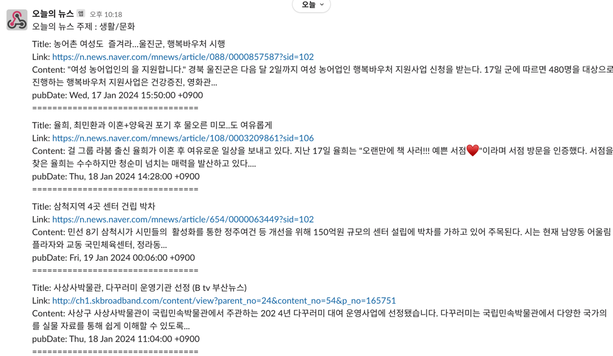

# Haru NEWS (하루 뉴스)

---

### 프로젝트 소개

> "하루 뉴스"는 뉴스를 잘 보지 않아 사회적 이슈를 빠르게 접하지 못하는 저의 상황을 개선하고자 개발 되었습니다. 매일 아침 9시 랜덤 카테고리(경제, 사회, 생활/문화 등) 기반 최신 뉴스 소식을 슬랙을 통해
> 받아볼 수
> 있도록 만들었습니다.

### 프로젝트 기간 및 멤버

- `기간` : 2024-01-20 ~ 2024-01-20
- `멤버` : 개인 프로젝트

### 기술 스택

- `Backend` : Spring Boot 3.2.2, Java 17
- `Infra` : aws(ec2, parameter-store)

### 프로젝트 사용 기능

- `Slack` : Slack의 Webhook을 이용하여 채널에 메세지를 전송하도록 구현
- `Naver API` : Naver API를 이용하여 최신 뉴스 데이터를 받아오도록 구현

### WiKi 정리

- [AWS Parameter store를 이용한 application.yml의 민감정보 관리](https://github.com/park0jae/HaruNews/wiki/AWS-Parameter-store%EB%A5%BC-%EC%9D%B4%EC%9A%A9%ED%95%9C-application.yml%EC%9D%98-%EB%AF%BC%EA%B0%90%EC%A0%95%EB%B3%B4-%EA%B4%80%EB%A6%AC)
- [EC2 서버에서 @Scheduled가 제대로 동작하지 않는 문제](https://github.com/park0jae/HaruNews/wiki/EC2-%EC%84%9C%EB%B2%84%EC%97%90%EC%84%9C-@Scheduled%EA%B0%80-%EC%A0%9C%EB%8C%80%EB%A1%9C-%EB%8F%99%EC%9E%91%ED%95%98%EC%A7%80-%EC%95%8A%EB%8A%94-%EB%AC%B8%EC%A0%9C)

### 로컬에서 프로젝트 실행 방법

1. https://developers.naver.com/main/ 에 접속하여 Naver API 사용을 위한 Client-id, Client-secret을 발급 받아 application.yml에 설정합니다.
2. slack 앱에서 Incoming WebHooks를 추가하고, 메세지를 전달받을 채널을 설정합니다.
3. WebHooks 설정을 마치고 WebHook URL을 복사하여 application.yml에 설정합니다.
